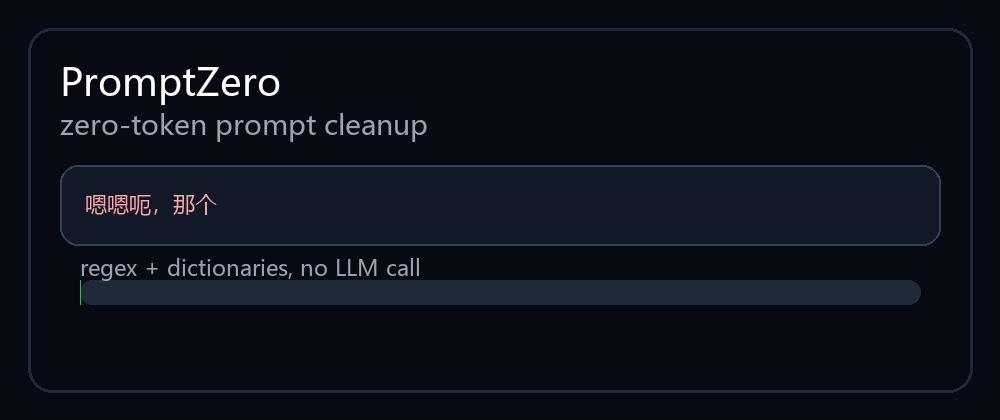

# PromptZero — Zero-Token Prompt Cleaner / 零成本提示词瘦身器

> Remove filler words, redundant politeness, repeated punctuation, and empty conversational padding **before** your prompt reaches an LLM — without calling another model and without spending extra tokens.
>
> 在提示词进入大模型之前，先用纯规则引擎剥离语气词、填充词、冗余礼貌用语和重复标点。**不调用模型，不产生额外 token 消耗。**

<p align="center">
  
</p>

<p align="center">
  
</p>

---

## 🌐 Why This Exists / 为什么需要它

Modern mainstream LLMs are transformer-based token prediction systems. They do not receive your sentence as human intention; they receive a token sequence. Every extra filler word, repeated punctuation mark, emoji, polite detour, or spoken-language pause becomes part of the model input window.

主流大模型的结构决定了一个很现实的问题：模型看到的不是“意图”，而是一串 token。人类自然语言里很多为了社交顺滑而存在的内容——“嗯”“那个”“就是说”“could you please”“thank you so much”——对模型完成任务通常没有帮助，但它们仍然占上下文窗口、增加输入成本，并可能降低指令密度。

PromptZero solves only the boring but expensive part: **remove obvious non-information before the request is sent.**

PromptZero 只解决一个朴素但实际的问题：**在发送请求前，把明显没有信息量的水分删掉。**

---

## ✨ What PromptZero Does / 它做到什么

- **Zero extra token cost** — no LLM, no embedding model, no remote API. Pure Python regex + dictionaries.
- **Bilingual cleanup** — Chinese filler particles and English filler phrases are both supported.
- **Code-safe** — fenced code blocks are preserved exactly.
- **Conservative by default** — avoids risky rules such as deleting every `like`, `just`, `so`, or Chinese referential “那个/这个”.
- **Hermes Agent ready** — includes the original Hermes skill under `hermes-skill/`.
- **CLI + Python API** — use it as a shell filter, module, or prompt preprocessor.

---

## 🔍 Compared with Other Prompt Skills / 和其他 Prompt Skill 的区别

Most prompt-related tools try to improve output quality by adding structure: roles, examples, constraints, chain-of-thought scaffolding, templates, or retrieval context. Those are useful, but they often **increase** the final prompt size.

大部分 prompt skill 的方向是“加东西”：加角色、加约束、加示例、加模板、加上下文。这当然有价值，但它们通常会让最终 prompt 更长。

PromptZero goes in the opposite direction:

| Tool Type | Typical Behavior | Token Effect | Model Call? |
|---|---|---:|---:|
| Prompt templates | Add structure and examples | Increases | No |
| RAG skills | Add retrieved context | Increases | Sometimes |
| Semantic compressors like LLMLingua | Rewrite/compress meaning | Decreases | Yes |
| PromptZero | Remove obvious filler only | Decreases | **No** |

PromptZero is not a semantic compressor. It does not summarize, rewrite, infer intent, or optimize wording with a model. That limitation is also its main advantage: **it cannot spend tokens while trying to save tokens.**

PromptZero 不是语义压缩器，不总结、不改写、不推理意图。它的优势恰恰在这里：**不会为了省 token 先花一笔 token。**

---

## 📉 How Much Can It Save? / 理论上能省多少

There is no universal number. Savings depend on how “wet” the original prompt is.

节省比例取决于原 prompt 的“水分”。实测和理论区间大致如下：

| Prompt Type / 类型 | Expected Reduction / 预期减少 |
|---|---:|
| Dense technical prompt / 高密度技术 prompt | 0–5% |
| Normal written request / 正常书面请求 | 5–15% |
| Spoken Chinese prompt / 口语化中文 prompt | 20–60% |
| Very polite English request / 礼貌堆叠英文请求 | 20–60% |
| Filler-heavy mixed prompt / 水分很重的中英混合 prompt | 40–75% |

Example:

```text
Input : 嗯嗯呃，那个那个，我就是说，能不能麻烦你帮我看看这个问题？谢谢啦！！
Output: 帮我看看这个问题？
Mode  : moderate
Saved : ~74% characters in this case
```

For already concise prompts, PromptZero does almost nothing. That is intentional.

如果 prompt 本来就很干净，PromptZero 基本不动它。这是设计目标，不是失败。

---

## 🚀 Quick Start / 快速开始

### CLI

```bash
git clone https://github.com/RICK-INFINITY-COM/PromptZero.git
cd PromptZero
python -m promptzero "嗯，那个，请问你能不能帮我写一个 Python 脚本？非常感谢！！" -l moderate
```

Pipe mode:

```bash
echo "Um, you know, I was wondering if you could help me parse JSON?" | python -m promptzero --stats -l moderate
```

### Python API

```python
from promptzero import clean, stats

text = "嗯，那个，请问你能不能帮我写一个 Python 脚本？非常感谢！！"
cleaned = clean(text, level="moderate")
print(cleaned)
print(stats(text, cleaned))
```

---

## ⚙️ Levels / 清理等级

| Level | Behavior | Recommended Use |
|---|---|---|
| `safe` | Removes clear filler words and repeated punctuation | Default daily use |
| `moderate` | Also shortens politeness and removes thank-you tails | Cost-sensitive prompts |
| `aggressive` | Also removes emoji | Only when emoji carries no meaning |

Environment variable:

```bash
export PROMPT_CLEANER_LEVEL=moderate
```

---

## 🧠 Rule Examples / 规则示例

### Chinese

- `嗯 / 呃 / 哦 / 噢` at standalone positions → removed
- `就是说 / 怎么说呢 / 我想问一下 / 我就是说` → removed
- `请问你能不能帮我` → `帮我` in `moderate`
- `非常非常 / 特别特别` → normalized
- Repeated punctuation like `！！` → `！`
- Referential words like `那个文件` and `这个 bug` are preserved

### English

- `um / uh / er / ah / hmm` → removed
- `you know / i mean` → removed
- `basically / actually / literally / to be honest` → removed in `moderate`
- `I was wondering if you could` → `please` in `moderate`
- `thank you so much / thanks in advance` → removed in `moderate`

---

## 🧱 Boundaries / 边界与不足

PromptZero is deliberately not smart. That is the point.

PromptZero 故意不“聪明”。这是设计选择。

Limitations:

1. **No semantic compression** — it cannot rewrite “please produce a concise migration plan” into “draft migration plan”.
2. **No context reasoning** — regex cannot always know whether a word is filler or meaningful.
3. **English is harder than Chinese** — English words like `like`, `just`, `well`, `so`, and `really` often carry real meaning, so the default rules are conservative.
4. **Not a prompt quality optimizer** — it reduces obvious waste; it does not make a bad request logically better.
5. **Token estimates are approximate** — exact token counts depend on the tokenizer used by your model provider.

If you need meaning-preserving rewriting, use a semantic compressor. If you need zero extra cost, use PromptZero.

如果你需要保语义改写，用语义压缩器。如果你需要零额外成本，用 PromptZero。

---

## 📦 Project Structure / 项目结构

```text
.
├── promptzero/
│   ├── __init__.py
│   ├── __main__.py
│   └── clean_prompt.py
├── hermes-skill/
│   ├── SKILL.md
│   └── scripts/clean_prompt.py
├── assets/
│   ├── logo.svg
│   └── demo.gif
├── examples/python_usage.py
├── tests/test_promptzero.py
├── pyproject.toml
├── requirements.txt
├── LICENSE
└── README.md
```

---

## ✅ Tests / 测试

```bash
python -m pytest tests -q
```

Or run a quick smoke test without pytest:

```bash
python -m promptzero "嗯，那个，帮我写个脚本？谢谢！！" -l moderate --stats
```

---

## 📄 License

MIT License. Free for personal, academic, and commercial use.

MIT 许可。个人、学术、商业用途都可自由使用。

---

## EN Summary

PromptZero is a rule-based preprocessor for LLM prompts. It removes obvious filler words and conversational padding before the request reaches the model. It does not call an LLM, does not spend tokens, and does not try to rewrite meaning. Its value is simple: reduce unnecessary input tokens without introducing another model into the pipeline.

## 中文总结

PromptZero 是一个面向大模型输入的纯规则预处理器。它在请求进入模型之前删除明显的语气词、填充词、冗余礼貌表达和重复标点。不调用模型、不消耗额外 token、不做语义改写。它解决的是一个很实际的问题：在不引入额外成本的前提下，减少无意义输入 token。
